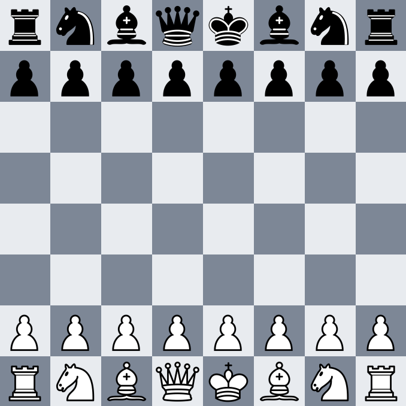

<div align="center">

# ♟ Chess Game — Java Edition

**A fully self-built chess application from scratch, built to learn.**

[](https://github.com/PBR208/Chess-Game/releases/tag/v1.0.0)
[](https://www.java.com)
[](LICENSE)
[]()
[]()

</div>

---

> 

---

## 🧠 Skills Applied

> This project was built from scratch as a deliberate learning exercise. The following areas of knowledge were actively
> developed and applied:

| Skill                          | Description                                                 |
|--------------------------------|-------------------------------------------------------------|
| **Object-Oriented Design**     | Modelling pieces, board, and game state as cohesive classes |
| **Inheritance & Polymorphism** | Shared `Piece` base class extended by each piece type       |
| **Game State Management**      | Tracking turns, captures, and board positions across moves  |
| **Algorithm Design**           | Legal move generation, check detection, and path validation |
| **Java Swing / GUI**           | Building an interactive board interface with click handling |
| **Event-Driven Programming**   | Responding to user input to select and move pieces          |
| **Debugging & Testing**        | Isolating logic bugs in move rules and edge cases           |

---

## 📖 About

This is a **fully hand-coded chess game built in Java** — no libraries, no tutorials, no shortcuts. The goal of this
project was to understand how a non-trivial application is designed from the ground up: from the data model, through
game logic, all the way to a playable graphical interface.

Every component — the engine, the board representation, the move validator, and the GUI — was written by hand as part of
a personal learning journey.

---

## ✨ Features

- **Full piece movement** — all six piece types with correct movement rules
- **Legal move generation** — only valid moves are permitted per turn
- **Check & Checkmate detection** — the game recognises when a king is in danger or the game is over
- **Turn management** — alternating play between White and Black
- **Interactive board** — click to select a piece and click to move it
- **Game state tracking** — the board correctly reflects captures and position history

---

## 🏗️ Project Structure

> Coming soon — will be documented once the codebase stabilises.

---

## 🚀 Getting Started

### Prerequisites

- Java **JDK 17** or later
- Any Java IDE (IntelliJ IDEA, Eclipse, VS Code with Java Extension Pack)

### Running the Game

**Clone the repository:**

```bash
git clone https://github.com/PBR208/Chess-Game.git
cd Chess-Game
```

**Compile from the command line:**

```bash
javac -d out src/**/*.java
```

**Run:**

```bash
java -cp out Main
```

**Or open in an IDE:**
Simply import the project folder and run `Main.java` directly.

---

## 🎮 How to Play

1. Launch the application — the board appears with pieces in starting position
2. Click on any of your pieces to select it
3. Valid destination squares will be highlighted
4. Click a highlighted square to make your move
5. The turn passes to the opponent
6. The game ends when checkmate or stalemate is detected

White always moves first.

---

## 📚 Documentation

### Core Concepts

#### Board Representation

The board is modelled as an 8×8 grid. Each `Square` holds either a `Piece` or is empty (`null`). Squares are addressed
by rank (row 1–8) and file (column a–h), mirroring standard chess notation.

```
  a   b   c   d   e   f   g   h
8 [♜] [♞] [♝] [♛] [♚] [♝] [♞] [♜]
7 [♟] [♟] [♟] [♟] [♟] [♟] [♟] [♟]
6 [ ] [ ] [ ] [ ] [ ] [ ] [ ] [ ]
5 [ ] [ ] [ ] [ ] [ ] [ ] [ ] [ ]
4 [ ] [ ] [ ] [ ] [ ] [ ] [ ] [ ]
3 [ ] [ ] [ ] [ ] [ ] [ ] [ ] [ ]
2 [♙] [♙] [♙] [♙] [♙] [♙] [♙] [♙]
1 [♖] [♘] [♗] [♕] [♔] [♗] [♘] [♖]
```

#### Piece Hierarchy

Each piece type extends the abstract `Piece` class and overrides the move generation logic:

```java
abstract class Piece {
    Color color;

    abstract List<Square> getLegalMoves(Board board);
}
```

This allows the `MoveGenerator` to iterate over all pieces polymorphically without needing to know each piece's specific
type.

#### Move Validation

Before a move is executed, the engine:

1. Generates all candidate moves for the selected piece
2. Filters out moves that would leave the player's own king in check
3. Presents only the remaining legal moves to the player

#### Check & Checkmate Detection

After every move, the engine scans all opponent pieces to determine whether their combined legal moves can reach the
current player's king square. If the king is in check **and** no legal moves exist to escape it, checkmate is declared.

---

## 🗺️ Roadmap

- [x] Board initialisation and piece placement
- [x] Basic piece movement logic
- [x] Legal move filtering (no self-check)
- [x] Check and checkmate detection
- [x] Interactive GUI with click-to-move
- [x] Castling (kingside and queenside)
- [x] En passant
- [x] Pawn promotion
- [x] Stalemate and draw detection
- [x] 50-Move rule / 75-Move forced draw
- [ ] Move history / notation log
- [ ] Simple AI opponent

---

## 🤝 Contributing

This is a personal learning project — issues, ideas, and suggestions are always welcome. Feel free
to [open an issue](https://github.com/PBR208/Chess-Game/issues).

---

## 📄 License

This project is licensed under the **MIT License** — see the [LICENSE](LICENSE) file for details.

---

<div align="center">

Made with ♟ and a lot of patience.

</div>
