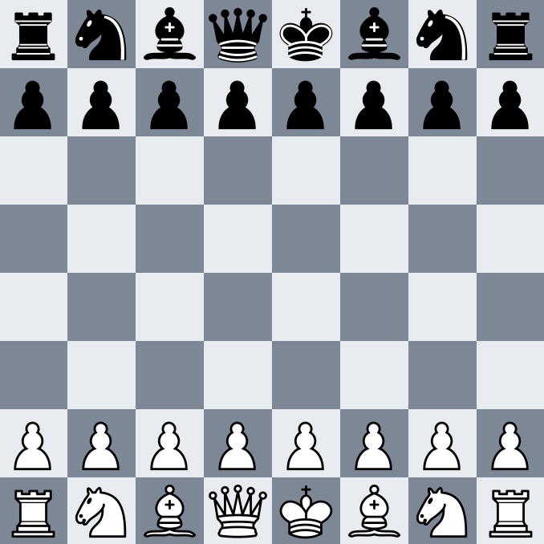

<div align="center">

# ♟ Chess Game — Java Edition

**A fully hand-built chess application — written from scratch to learn.**

[](https://github.com/PBR208/Chess-Game/releases/latest)
[](https://www.java.com)
[](LICENSE)
[]()
[]()

</div>

---

> 

---

## 🧠 What I Learned

This project was built from scratch as a deliberate learning exercise — no chess libraries, no tutorials, no engine
borrowed from elsewhere. Every line of logic was written by hand. These are the concrete skills I developed through it:

| Area                            | What I practised                                                                                                                                                                                                                                                                                                                                                                                                                                                                                                                                                                                                           |
|---------------------------------|----------------------------------------------------------------------------------------------------------------------------------------------------------------------------------------------------------------------------------------------------------------------------------------------------------------------------------------------------------------------------------------------------------------------------------------------------------------------------------------------------------------------------------------------------------------------------------------------------------------------------|
| **OOP & Inheritance**           | Designed a `Piece` base class extended by six concrete types; `GameController` and `CheckScanner` operate on the abstract type through polymorphism                                                                                                                                                                                                                                                                                                                                                                                                                                                                        |
| **Game State Management**       | Tracking turn ownership, en passant eligibility, first-move flags, the 50/75-move counter, and clock state — all kept consistent across moves and game resets                                                                                                                                                                                                                                                                                                                                                                                                                                                              |
| **Algorithm Design**            | Legal move generation with path-blocking (`isValidCollide`), simulation-based check detection (move → scan → undo), checkmate/stalemate via exhaustive move search                                                                                                                                                                                                                                                                                                                                                                                                                                                         |
| **Coordinate Systems**          | Separating logical grid coordinates from pixel positions, then adding a perspective flip so the current player is always at the bottom                                                                                                                                                                                                                                                                                                                                                                                                                                                                                     |
| **Java Swing & Graphics2D**     | Custom `paintComponent` rendering with anti-aliasing, a live `ChessClock` drawn with `Graphics2D`, sprite sheet slicing with `getSubimage`, and modal `JDialog` overlays                                                                                                                                                                                                                                                                                                                                                                                                                                                   |
| **Event-Driven Programming**    | `MouseListener` and `MouseMotionListener` wired to game logic; `javax.swing.Timer` driving a clock tick via a functional callback interface                                                                                                                                                                                                                                                                                                                                                                                                                                                                                |
| **Persistence & Serialization** | Hand-rolled PGN writer/parser (`PgnManager`), FEN generation and loading (`FenGenerator`/`FenLoader`), and algebraic notation output (`NotationHelper`)                                                                                                                                                                                                                                                                                                                                                                                                                                                                    |
| **UI Navigation & State**       | A panel-swapping menu system (`MainMenu` → `NewGamePanel` → `Board` / `PastGamesPanel` → `ReplayPanel`) driven by a config object (`GameConfig`)                                                                                                                                                                                                                                                                                                                                                                                                                                                                           |
| **Dependency Inversion**        | `GameController` no longer constructs `PromoteGUI`/`FiftyRuleDraw` directly — it depends on `PromotionChooser`/`DrawOfferResolver` interfaces, with `Swing*` classes supplying the real dialogs. The rules engine imports nothing from `ui` at all now: the dialogs, the clocks, the repaint and the move log are interfaces the engine defines itself and the Swing classes implement                                                                                                                                                                                                                                                                                                                                                                                   |
| **Separation of Concerns**      | Split what was one `Board` class doing four jobs (rendering, position data, coordinate flipping, clock ownership) into `Board` (rendering) + `BoardState` (position data); split move-history bookkeeping out of `GameController` into `MoveHistory`; pulled the repeated dark-theme styling out of four GUI panels into `Theme`/`UiComponents`; then carried that same separation all the way through the package layout — `ui.board`, `ui.menu`, and `ui.theme` hold everything that opens or draws a window, `engine.model` and `engine.persistence` hold no window code at all, and `engine.imports` and `engine.pieces` are free of window code as well, which the build checks on every run |
| **Refactoring**                 | Introduced enums (`DrawResult`, `Choice`) to replace magic strings; every refactor here was done as a small, isolated, behavior-preserving change verified by a full recompile each time                                                                                                                                                                                                                                                                                                                                                                                                                                   |
| **Testing**                     | Built a minimal test runner from scratch — named tests, assertion helpers, auto-dismissing modal dialogs via `Timer`-scheduled `doClick()` — and grew it alongside the refactors above so the newly-decoupled engine classes are now testable without any dialog simulation at all                                                                                                                                                                                                                                                                                                                                         |
| **Git Workflow**                | Feature branching, PRs per feature (`enPassantFix`, `clock`, `50MoveRule`, `boardFlip`, …), tagged releases                                                                                                                                                                                                                                                                                                                                                                                                                                                                                                                |

---

## 📖 About

A playable two-player chess game written entirely in Java. The goal was to understand how a non-trivial application gets
built from the ground up — from the board model through to a working graphical interface — without relying on any
external chess logic.

Both players share the same screen. The board flips after each move so the active player always faces their own pieces
from the bottom, mimicking a physical board rotation.

The app has a full front end: a main menu leads into a **New Game** setup screen (player names, time-control presets
or a custom clock) and a **Past Games** library, where every finished game is saved to disk as a PGN file and can be
reopened later, either as a plain move log or stepped through move-by-move on a mini replay board.

---

## ✨ Features

| ✅ Implemented                                                                                           | ❌ Not Yet Implemented                     |
|---|---|
| All six piece types with correct movement rules | AI opponent |
| Legal move generation, self-check moves filtered out | Sound effects |
| Check & checkmate detection | Online / network play |
| Stalemate detection | |
| Castling, kingside & queenside with full validation | |
| En passant, including captures that answer a check and pins along the rank | |
| Pawn promotion with a piece selector in the promoting side's colours | |
| 50-move draw claim / 75-move forced draw | |
| Threefold repetition claim / fivefold repetition forced draw | |
| Insufficient material draw, and a draw on time against a lone king | |
| Chess clock with bullet/blitz/rapid/classical presets, increments, or a custom duration | |
| Board perspective flip after each move | |
| Move highlighting on piece selection | |
| End screen on checkmate, stalemate, draws, or time loss | |
| Piece sprites loaded from a sprite sheet | |
| Move history / live move log panel | |
| Main menu with New Game & Past Games navigation | |
| Custom player names per game | |
| Standard algebraic notation with check, mate, and disambiguation (`Nbd2`, `Qh4#`) | |
| PGN export, every finished game auto-saved to your user data folder | |
| FEN generation & parsing for board positions | |
| Past-games library with saved move logs | |
| Move-by-move replay viewer for saved games | |
| Window and board sized to fit smaller screens, with fonts every OS has | |

---

## 🏗️ Project Structure

```
build/
└── Build.java                        # Zero-dependency build script: clean, compile, test, test-gui, jar, run
.github/
└── workflows/
    └── ci.yml                        # Build and tests on Windows, macOS, and Linux with JDK 17 and 25
src/
├── app/
│   └── Main.java                     # Entry point — owns the JFrame, swaps in menu/game/library panels
├── engine/
│   ├── imports/                      +— still imports ui.board.Board and MoveLogPanel
│   │   ├── GameController.java       # Turn management, move execution, game-end rule checks
│   │   ├── CheckScanner.java         # Simulate-and-undo check detection
│   │   ├── Move.java                 # Value object: piece + target square + captured piece
│   │   ├── BoardState.java           # Position data (pieces list, grid, en passant tile)
│   │   ├── MoveHistory.java          # Bundles moveLog + fenHistory + notation + move-log-panel updates
│   │   ├── NotationHelper.java       # Move → algebraic notation (O-O, Nf3, exd5, e8=Q, …)
│   │   ├── FenGenerator.java         # BoardState → FEN string after every move
│   │   ├── PromotionChooser.java     # Interface: "give me a promotion choice" — no Swing dependency
│   │   ├── DrawOfferResolver.java    # Interface: "offer/notify a draw" — no Swing dependency
│   │   ├── GameView.java             # Interface: the clocks and the repaint the rules ask for
│   │   ├── MoveLogView.java          # Interface: where recorded moves are shown
│   │   └── StartPosition.java        # The 32 pieces of a new game on their home squares
│   ├── model/
│   │   ├── GameConfig.java           # Player names + time control, passed from menu into a game
│   │   └── GameRecord.java           # Immutable record of a finished/loaded game (moves, FENs, result)
│   ├── persistence/
│   │   ├── FenLoader.java            # FEN string → piece grid, used by the replay viewer
│   │   └── PgnManager.java           # Saves finished games as .pgn files and reloads them
│   └── pieces/
│       ├── Piece.java                # Base class: position, colour, sprite, move hooks
│       ├── PieceType.java            # Enum of the six piece types + sprite-sheet display name
│       ├── King.java                 # ±1 in any direction + castling
│       ├── Queen.java                # Rook + Bishop combined
│       ├── Rook.java                 # Horizontal / vertical sliding
│       ├── Bishop.java               # Diagonal sliding
│       ├── Knight.java               # L-shape jump (no collision check)
│       └── Pawn.java                 # Forward push, diagonal capture, en passant, promotion
├── ui/
│   ├── board/                        # The live game screen
│   │   ├── Board.java                # JPanel: renders board, clocks, pieces; delegates position data to BoardState
│   │   ├── ChessClock.java           # Timer-driven clock with Graphics2D rendering
│   │   ├── EndScreen.java            # Result dialog (checkmate / stalemate / time)
│   │   ├── FiftyRuleDraw.java        # 50/75-move draw dialog
│   │   ├── PromoteGUI.java           # Promotion piece selector dialog
│   │   ├── SwingPromotionChooser.java   # Implements PromotionChooser using PromoteGUI
│   │   ├── SwingDrawOfferResolver.java  # Implements DrawOfferResolver using FiftyRuleDraw
│   │   ├── MoveLogPanel.java         # Live move log shown next to the board during play
│   │   ├── Input.java                # Mouse event → game action
│   │   └── PieceSprites.java         # Loads, slices, scales and caches the piece sprite sheet
│   ├── menu/                         # App navigation screens
│   │   ├── MainMenu.java             # Landing screen — New Game / Past Games
│   │   ├── NewGamePanel.java         # Player names + time-control presets/custom clock, then starts a game
│   │   ├── PastGamesPanel.java       # Split-pane library of saved games (list + move log / replay toggle)
│   │   └── ReplayPanel.java          # Mini board that scrubs through a saved game's FEN history
│   └── theme/
│       ├── Theme.java                # Shared dark-theme color palette for the menu-style screens
│       └── UiComponents.java         # Shared button styling/hover-effect factory
├── resources/
│   └── pieces.png                    # Sprite sheet, loaded from the classpath as /resources/pieces.png
└── test/
    ├── GameTest.java                 # Standalone test runner (no external framework) — see Testing below
    └── GuiTestSelector.java          # Launcher window that previews single screens by hand
```

**Why `engine` and `ui` are separate top-level packages, not just separate classes:** the split marks where the rules
end and the windows begin, and it is a clean cut now. Nothing under `engine/` imports `ui`, `java.awt` or `javax`.
The pieces read the position they stand in from `BoardState`, and `GameController` asks for the clocks, a repaint and
the move log through the `GameView` and `MoveLogView` interfaces that the engine defines itself and the Swing classes
implement. The build enforces it: `java build/Build.java verify` fails on the first line of an engine source that
mentions a window class. `ui/board` and `ui/menu` are the only places a `JFrame`/`JDialog` gets created.

**Why `BoardState` is separate from `Board`:** `Board` is a `JPanel` — it renders, owns the two clocks, and handles
coordinate flipping. Before this split, it *also* owned the raw pieces list, the grid, and the en passant tile
directly, which meant `GameController`, `CheckScanner`, and `FenGenerator` all needed a live Swing component just to
ask "what's on this square?". `BoardState` holds exactly that position data with zero AWT/Swing imports.

**Why `PromotionChooser`/`DrawOfferResolver` exist:** `GameController` used to build `new PromoteGUI(...)` and
`new FiftyRuleDraw(...)` directly, which meant "decide what a pawn promotes to" was inseparable from "show a modal
dialog." These two interfaces let `GameController` ask an abstraction instead; `SwingPromotionChooser` and
`SwingDrawOfferResolver` are the real, dialog-backed answers `Board` supplies, but a test (or any future non-Swing
front end) can supply its own.

**What is left, flagged rather than hidden:** the dependency points one way now, but the position itself is still a
mutable object graph of `Piece` objects behind a `BoardState` grid, and `CheckScanner` still judges a move by making
it, scanning the board and putting everything back. That is not re-entrant, it has no make and unmake, and it is far
too slow to search with. Replacing it with a bitboard position is the next step, and that is a rewrite of the model
rather than a folder reorganization.

---

## 🔬 How Check Detection Works

Before any move is committed, the engine temporarily applies it, scans every opponent piece to see if it can now reach
the friendly king, then restores the board. Only moves that leave the king safe are legal:

```java
// CheckScanner.java
public boolean isKingLeftInCheck(Move move) {
    // 1. Apply the move tentatively
    piece.setCol(move.getNewCol());
    piece.setRow(move.getNewRow());
    if (captured != null) state.removePiece(captured);

    // 2. Keep the grid in sync, sliding pieces look up blockers there
    state.moveOnGrid(piece, oldCol, oldRow);

    // 3. Scan all opponent pieces
    boolean inCheck = isKingInCheckRN(piece.isWhite());

    // 4. Undo, restore the original state
    piece.setCol(oldCol);
    piece.setRow(oldRow);
    state.moveOnGrid(piece, move.getNewCol(), move.getNewRow());
    if (captured != null) state.addPiece(captured);

    return inCheck;
}
```

Checkmate is declared when the king is in check **and** this simulation returns `true` for every possible move of every
friendly piece.

Early versions only moved the piece itself during this simulation and left `BoardState`'s grid alone, so a sliding
piece could still look through the square the moving piece had just left. Moves that blocked a check were rejected,
and a discovered attack on the moving side's own king went unnoticed. Syncing the grid in step 2 fixed both, and the
test suite covers blocking a check as well as a discovered check. An en passant capture is simulated the same way,
with the passed pawn removed before the scan.

---

## ✅ Testing

`test/GameTest.java` is a from-scratch test runner (no JUnit) with 182 named test cases, grouped by the class
they exercise — `GameConfig`, `GameRecord`, `BoardState`, `Move`/`CheckScanner`, `NotationHelper`, `FenGenerator`,
`MoveHistory`, `PieceType`, `ChessClock`, the dialogs, the menu panels, and `GameController`'s full rules engine
(moves, captures, castling, en passant, promotion, checkmate, stalemate, the 50/75-move rules, repetition, and insufficient material).

Because `GameController` depends on the `PromotionChooser`/`DrawOfferResolver` interfaces rather than concrete
dialogs, the rules-engine tests drive promotion and draw scenarios with small fake implementations instead of
simulating dialog clicks — no `Timer`-scheduled `doClick()` needed for any of that coverage. The dialog classes
themselves (`PromoteGUI`, `FiftyRuleDraw`, `EndScreen`) and the two `Swing*` wrapper classes are still tested the
old way, since they're the parts that genuinely need a real window.

**Run the tests** from the repository root. The same commands work in PowerShell, `cmd.exe`, and any Unix shell:

```bash
java build/Build.java test        # headless: rules, notation, persistence and panel tests
java build/Build.java test-gui    # also opens the real dialogs and frames, needs a display
```

`test` runs the suite in a headless JVM, the way a build server would. Tests that need a real window, such as the
modal dialogs or a `JFrame`, are reported as skipped there instead of failing, so a headless run ends with 152 passed
and 30 skipped, while `test-gui` runs all 182. A watchdog closes any dialog a test left open and fails that test
instead of hanging the run, and the suite saves its games to a temporary folder, so it never touches your own library.

Every push to `main` and every pull request builds the game and runs the headless tests on Windows, macOS, and Linux
with JDK 17 and JDK 25, plus the window tests on Linux under a virtual display (see `.github/workflows/ci.yml`).

---

## 🚀 Getting Started

### Prerequisites

A Java **JDK 17** or later is all you need. The build script is plain Java, so there is no Maven, Gradle, or shell
script to install. An IDE (IntelliJ IDEA, Eclipse, VS Code with the Java Extension Pack) is optional.

### Running the Game

**Clone the repository:**

```bash
git clone https://github.com/PBR208/Chess-Game.git
cd Chess-Game
```

**Build and run from the command line**, with the same commands on Windows, macOS, and Linux:

```bash
java build/Build.java              # compile for Java 17, run the headless tests, package out/Chess-Game.jar
java build/Build.java run          # compile if needed and start the game
java -jar out/Chess-Game.jar       # start the packaged jar
```

The script also knows the targets `clean`, `verify`, `compile`, `test`, `test-gui`, and `jar`, and runs several of them in the
order given. It compiles with `--release 17` and UTF-8 source encoding no matter which JDK runs it, copies
`src/resources` next to the classes so the sprite sheet is found, and refuses to package class files that need a Java
newer than 17. `verify` fails the build when any source below `src/engine` mentions the `ui` package, AWT or Swing, so the rules engine cannot quietly grow a dependency on a window again.

**Or open in an IDE:** import the project folder, mark `src` as the source root, and run `app.Main`.

The game needs a graphical display. Started without one, for example on a server or with `-Djava.awt.headless=true`,
it prints what is missing and exits with code 2 instead of failing silently.

> **About the release jar:** the `Chess-Game.jar` attached to
> [v1.2.1](https://github.com/PBR208/Chess-Game/releases/tag/v1.2.1) was built for Java 25 and won't start on older
> runtimes. Until the next release is out, build the jar yourself as shown above, or download the `Chess-Game-jar`
> artifact of a recent CI run, which targets Java 17.

---

## 🎮 How to Play

1. Launch the application — you land on the main menu
2. Choose **New Game**, enter each player's name, and pick a time control (a preset like Blitz 5+0, or a custom
   minutes/seconds duration) — then **Start**
3. Click one of your pieces to select it — valid moves are highlighted in green
4. Click a highlighted square to move
5. The board flips so the other player faces their own pieces from the bottom
6. The clocks switch automatically; a player who runs out of time loses, unless the player still on time has only a king left or neither side has enough material to checkmate, which makes it a draw
7. The game ends on checkmate, stalemate, time loss, or a draw by repetition, insufficient material, or the 50/75-move
   rule, and the result is saved automatically as a PGN file (see below for where)

White always moves first.

Saved games go to your user data folder: `%APPDATA%\ChessGame\games` on Windows,
`~/Library/Application Support/ChessGame/games` on macOS, and `$XDG_DATA_HOME/chess-game/games` (usually
`~/.local/share/chess-game/games`) on Linux. Pass `-Dchess.gamesDir=<folder>` to `java` to use another folder. Games
from the old `games/` folder in the working directory are copied over once, the first time the game reads or writes
saved games.

From the main menu, **Past Games** opens a library of every saved game. Select one to view its full move log, or
switch to the **Replay** tab to step through the position move-by-move on a mini board.

---

## 🤝 Contributing

This is a personal learning project — issues, ideas, and suggestions are always welcome. Feel free
to [open an issue](https://github.com/PBR208/Chess-Game/issues).

---

## 📄 License

This project is licensed under the **MIT License** — see the [LICENSE](LICENSE) file for details.

---

<div align="center">

Made with ♟ and a lot of patience.

</div>